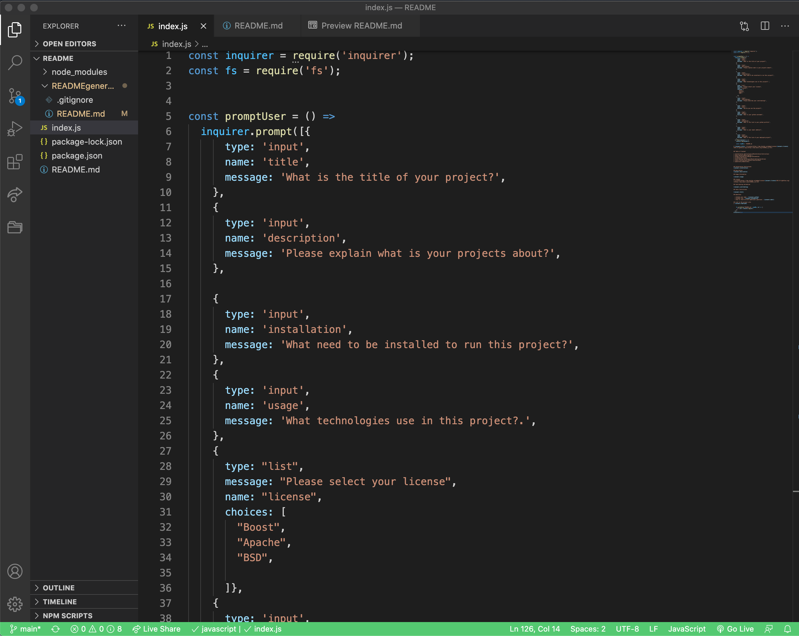
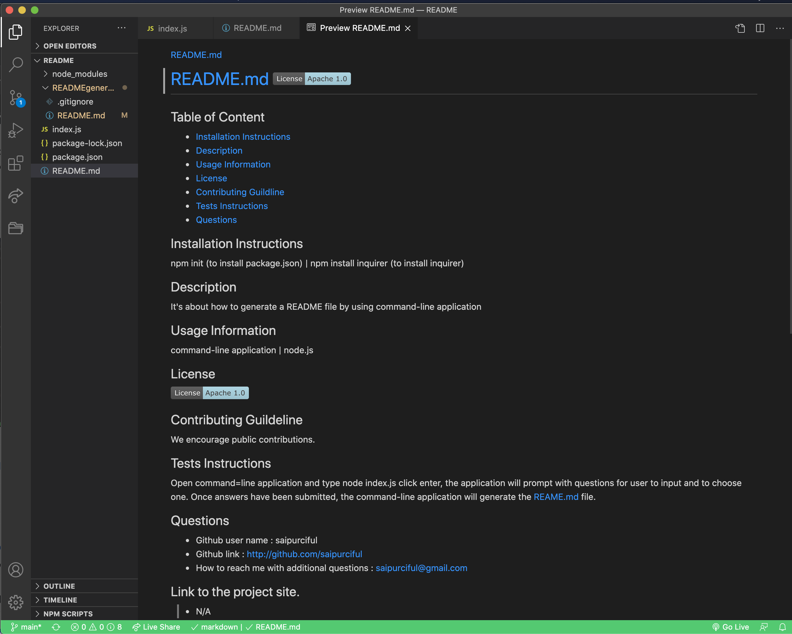

# README.md 

## Table of Content

* [Installation Instructions](#Installation-Instruction)
* [Description](#Description )
* [Usage Information](#Usage-Information)
* [License](#License)
* [Contributing Guildline](#Contributing-Guildline)
* [Tests Instructions](#Tests-Instructions)
* [Demonstration video](Demonstration-video) 
* [How to Create](#How-to-Create)
* [Questions](#Questions)

## Installation Instructions
npm init (to install package.json) | npm install inquirer (to install inquirer)

## Description
It's an easy way to generate a README file by using command-line application

## Usage Information

command-line application | node.js

## License

## Contributing Guildeline

We encourage public contributions! 

## Tests Instructions

Open command-line application and type node index.js click enter, the application will prompt with questions for user to input and to choose one. Once all the answers have been submitted, the command-line application will generate the README.md file.

##  Demonstration video

* Link to Demonstration on YouTube: https://www.youtube.com/embed/1W9DCzCqo18

## How to Create
  * Create index.js file and install npm init and npm install requirer in command-line. Use the function to prompt the questions to the user. 

  
  

  * Open command-line application and use node index.js, the command-line will prompt the question to the user  

  

  * Once all the answer have been submitted, the command-line application will generate README.md file  

  

## Questions

  * Github user name : saipurciful  
  * Github link : http://github.com/Saipurciful
  * How to reach me with additional questions : saipurciful@gmail.com

## Link to the project site. 
* N/A
